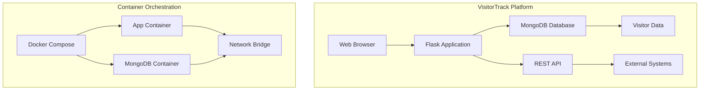

# VisitorTrack: Modern Containerized Analytics Platform


## Overview

VisitorTrack is a production-ready analytics platform that provides real-time visitor tracking and engagement metrics for modern web applications. Built with containerization best practices, this solution demonstrates enterprise-grade deployment patterns with MongoDB persistence, RESTful APIs, and a responsive dashboard interface.

**Live Demo:** [http://localhost:5000](http://localhost:5000) (when deployed locally)

## Features

### Real-time Analytics
- **Visitor Counter**: Automatic tracking of unique and total visits
- **Session Analytics**: Detailed visit timing and duration metrics
- **Real-time Updates**: Live dashboard with instant data refresh
- **Historical Data**: Persistent storage of all visitor interactions

### Production-Ready Architecture
- **Containerized Microservices**: Docker-based deployment with optimized images
- **MongoDB Integration**: Scalable NoSQL database with persistent storage
- **RESTful API**: Comprehensive endpoints for integration and automation
- **Health Monitoring**: Built-in health checks and status reporting

### Modern Dashboard
- **Responsive Design**: Bootstrap-powered interface works on all devices
- **Interactive UI**: Real-time metrics with visual indicators
- **Admin Controls**: Manual counter reset and system management
- **Status Monitoring**: Live system health and connection status

## Technical Architecture



##  Tech Stack

- **Backend Framework**: Flask 2.3.0 with Python 3.9+
- **Database**: MongoDB 6.0+ with PyMongo driver
- **Frontend**: Bootstrap 5.3+ with responsive design
- **Containerization**: Docker with multi-stage builds
- **Orchestration**: Docker Compose for development and production
- **API**: RESTful JSON API with comprehensive endpoints

## Installation & Quick Start

### Prerequisites

```bash
# Verify Docker installation
docker --version
docker-compose --version

# Clone the repository
git clone https://github.com/CHAFAH/visitor-track.git
cd visitor-track
```

### Development Deployment

```bash
# Copy environment configuration
cp .env.example .env

# Build and start containers
docker-compose up --build -d

# Verify services are running
docker-compose ps

# View application logs
docker-compose logs -f app
```

### Production Deployment

```bash
# Use production configuration
docker-compose -f docker-compose.yml -f docker-compose.prod.yml up -d

# Scale services if needed
docker-compose up -d --scale app=3
```

## 🌐 Access Points

| Service | URL | Description |
|---------|-----|-------------|
| Web Application | http://localhost:5000 | Main dashboard interface |
| Health Check | http://localhost:5000/health | System status API |
| Metrics API | http://localhost:5000/metrics | JSON metrics endpoint |
| MongoDB Console | mongodb://localhost:27017 | Database administration |

## 🔌 API Endpoints

### RESTful API Documentation

```bash
# Get health status
curl http://localhost:5000/health

# Retrieve metrics
curl http://localhost:5000/metrics

# Reset counter (POST)
curl -X POST http://localhost:5000/reset

# Get visitor statistics
curl http://localhost:5000/api/visitors

# Get system information
curl http://localhost:5000/api/system
```

### Example API Response

```json
{
  "status": "healthy",
  "visitors": 1427,
  "uptime": "3 days, 12 hours",
  "database": "connected",
  "version": "2.1.0"
}
```

## 📁 Project Structure

```
visitor-track/
├── app.py                    # Main Flask application
├── requirements.txt          # Python dependencies
├── Dockerfile               # Development container configuration
├── Dockerfile.prod          # Production-optimized container
├── docker-compose.yml       # Development environment
├── docker-compose.prod.yml  # Production deployment
├── .env.example             # Environment template
├── .dockerignore           # Docker build exclusions
└── templates/
    └── index.html          # Dashboard template (Bootstrap 5)
```

## 🚀 Performance Features

- **Optimized Containers**: Multi-stage builds for minimal image size
- **Database Indexing**: Optimized MongoDB queries with proper indexing
- **Connection Pooling**: Efficient database connection management
- **Caching Layer**: Ready for Redis integration for enhanced performance
- **Horizontal Scaling**: Designed for container orchestration platforms

## 🔧 Management Commands

### Container Operations

```bash
# Start services
docker-compose start

# Stop services
docker-compose stop

# Restart services
docker-compose restart

# View logs
docker-compose logs -f app
docker-compose logs -f mongodb

# Access container shell
docker-compose exec app bash
```

### Database Management

```bash
# Access MongoDB shell
docker-compose exec mongodb mongosh

# View visitor data
docker-compose exec mongodb mongosh --eval "db.visitors.find().pretty()"

# Create backup
docker-compose exec mongodb mongodump --out /data/backup

# Check database status
docker-compose exec mongodb mongosh --eval "db.stats()"
```

## Testing

```bash
# Run unit tests
docker-compose exec app python -m pytest tests/

# Test API endpoints
docker-compose exec app curl http://localhost:5000/health

# Load testing (install siege first)
siege -c 100 -t 1M http://localhost:5000
```

## 🐛 Troubleshooting

### Common Issues

**Containers won't start:**
```bash
# Rebuild with no cache
docker-compose build --no-cache

# Check for port conflicts
netstat -tulpn | grep :5000
```

**Database connection issues:**
```bash
# Check MongoDB logs
docker-compose logs mongodb

# Verify environment variables
docker-compose exec app env | grep MONGO
```

**Application errors:**
```bash
# Check application logs
docker-compose logs app

# Restart application container
docker-compose restart app
```

### Reset Environment

```bash
# Complete cleanup
docker-compose down -v
docker system prune -a
docker volume prune

# Fresh start
docker-compose up --build -d
```

## 📈 Monitoring & Analytics

The platform includes built-in monitoring capabilities:

- **Health Checks**: Automated system status monitoring
- **Performance Metrics**: Response times and throughput tracking
- **Database Metrics**: Connection pool and query performance
- **Visitor Analytics**: Geographic and temporal visit patterns
- **System Resources**: CPU, memory, and network utilization

##  Future Enhancements

- [ ] Redis caching for improved performance
- [ ] Kubernetes deployment manifests
- [ ] Prometheus metrics integration
- [ ] Grafana dashboard templates
- [ ] User authentication and multi-tenant support
- [ ] Advanced analytics and reporting
- [ ] WebSocket support for real-time updates
- [ ] Mobile application companion

## Contributing

Contributions are welcome! Please feel free to submit a Pull Request.

1. Fork the project
2. Create your feature branch (`git checkout -b feature/AmazingFeature`)
3. Commit your changes (`git commit -m 'Add some AmazingFeature'`)
4. Push to the branch (`git push origin feature/AmazingFeature`)
5. Open a Pull Request

## 📄 License

This project is licensed under the MIT License - see the [LICENSE](LICENSE) file for details.

## 📞 Contact

[](https://www.linkedin.com/in/fafungndeh/)
[](https://github.com/sheenandeh)

---

**⭐ Star this repo if you found it useful!**

---

*VisitorTrack is built with modern DevOps practices and demonstrates production-ready containerization strategies for web applications.*
